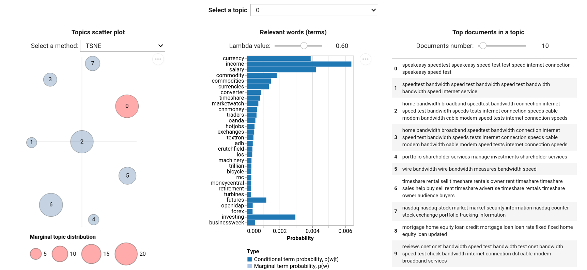

# tmplot

**tmplot** is a Python package for visualizing topic modeling results. It provides the interactive report interface that borrows much from LDAvis/pyLDAvis and builds upon it offering a number of metrics for calculating topics distances and a number of algorithms for calculating scatter coordinates of topics.

<!--  -->


## Features

* Supported models:

  * tomotopy: `LDAModel`, `LLDAModel`, `CTModel`, `DMRModel`, `HDPModel`, `PTModel`, `SLDAModel`, `GDMRModel`
  * gensim: `LdaModel`, `LdaMulticore`
  * bitermplus: `BTM`

* Supported distance metrics:

  * Kullback-Leibler (symmetric and non-symmetric) divergence.
  * Jenson-Shannon divergence
  * Jeffrey's divergence
  * Hellinger distance
  * Bhattacharyya distance
  * Total variation distance
  * Jaccard inversed index

* Supported algorithms for calculating topics scatter coordinates:

  * t-SNE
  * SpectralEmbedding
  * MDS
  * LocallyLinearEmbedding
  * Isomap

## Installation

The package can be installed from PyPi:

```bash
pip install tmplot
```

Or directly from this repository:

```bash
pip install git+https://github.com/maximtrp/tmplot.git
```

## Dependencies

* `numpy`
* `scipy`
* `scikit-learn`
* `pandas`
* `altair`
* `ipywidgets`
* `tomotopy`, `gensim`, and `bitermplus` (optional, for using models objects directly)

## Quick example

```python
```
